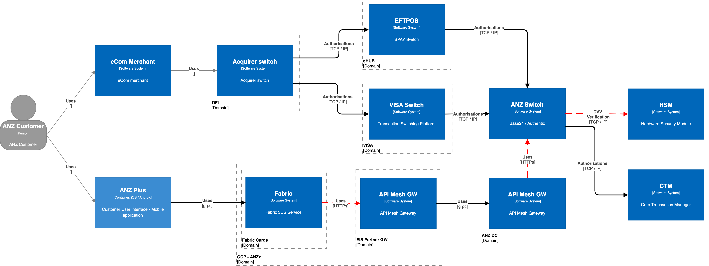

# Context
Initial requirement of displaying the CVV2 in the app to enable customers to perform online purchases without having to look for the physical card was improvised to have dynamic cvv2 displayed in the app instead of the one printed on the back of physical card. This was done to promote better security and the future feature of removing the CVV printed on card, as explained in the architectural decision at DIST-040 Dynamic CVV Generation. The recommended decision was implemented using Visa's apis for a quicker TTM and to test the feature with customers. This feature was well received by many customers but a transaction with a dynamic cvv2 gets completed successfully only if Visa is part of the authorisation. This is due to the fact that the dynamic cvv2 is converted to the static cvv by Visa before the transaction is sent for authorisation to ANZ switch since the switch does not recognise a dynamic cvv2 as the right card verification value. If Visa is not part of the transaction authorisation like the transactions routed through EFTPOS by the online merchant for purpose of Least Cost Routing, then the transaction would be declined by our switch for invalid CVV. With the uptake of this feature and ever growing customer base of ANZ Plus, it is imperative that we build an in-house solution instead of being dependant on Visa.

A dynamic CVV is a time bound card verification value that is valid only for a specific period of time. So, the generation and verification of it needs to consider a specific time window while using the CVV generation algorithm. ANZ switch (Base24 & Authentic) uses Thales PayShield 10K HSM for all types of CVV generation and verification and the product in its latest versions provides support of the dynamic cvv generation and verification. Although this could be leveraged the switch software needs to impement specific logic to stitch the different HSM commands to enable successful transaction authorisation for all online purchases regardless of how it is routed to the switch and what CVV2 the customer uses during purchase.

#Solution Overview

##Behavioural Models

!!! info "Three Phases"

    === "Phase 1"

      ::uml:: format="png" classes="uml myDiagram" alt="My super diagram placeholder" title="My super diagram" width="1500px" height="1500px"
      actor "ANZ Card Holder" as customer
      participant "eCom Merchant" as merchant
      participant "Acquirer" as acquirer
      participant "EFTPOS" as eftpos
      participant "VISA" as visa
      participant "ANZ Channel" as app
      participant "BFF" as bff
      participant "Base 24" as bswitch
      participant "Payshield HSM" as hsm
      participant "CTM" as ctm

      customer -> app : Show me a dynamic CVV
      app -> bff : Get a dynamic CVV
      customer -> app : Show me a dynamic CVV
      app -> bff : Get a dynamic CVV
      bff -> visa : Get dynamic CVV for the card & expiry
      visa --> bff : Dynamic CVV
      bff --> app : Dynamic CVV
      app --> customer : Dynamic CVV
      customer -> merchant : Purchase what i like
      merchant -> acquirer : Authorise transaction
      acquirer -> acquirer : LCR choice
      acquirer -> eftpos : Authorise transaction
      eftpos -> bswitch : Authorise transaction
      bswitch -> hsm : Verify CVV2\n"Command = 'CY'"
      hsm --> bswitch : Verification result
      group#Gold #LightGreen Change Needed
      alt if Failed
      bswitch -> hsm : Verify dynamic CVV2\nCommand = 'PM' with\nScheme ID = 5\nVersion = 0\ncurrent time and TWU
      hsm --> bswitch : Verification result
      alt if Failed
      bswitch -> hsm : Verify dynamic CVV2\nCommand = 'PM'with\nScheme ID = 5\nVersion = 0\ntime minus TWU and TWU"
      hsm --> bswitch : Verfication result
      end
      end
      end
      bswitch -> ctm : Authorise transaction
      ctm --> bswitch : Authorisation result
      bswitch --> eftpos : Authorisation result
      eftpos --> acquirer : Authorisation result
      acquirer --> merchant : Authorisation result
      merchant --> customer : Purchase result
      ::end-uml::

    === "Phase 2"

      ::uml::format="png" classes="uml myDiagram" alt="My super diagram placeholder" title="My super diagram" width="1500px" height="1500px"
      actor "ANZ Card Holder" as customer
      participant "eCom Merchant" as merchant
      participant "Acquirer" as acquirer
      participant "EFTPOS" as eftpos
      participant "VISA" as visa
      participant "ANZ Channel" as app
      participant "BFF" as bff
      participant "Authentic" as aswitch
      participant "Payshield HSM" as hsm
      participant "CTM" as ctm

      customer -> app : Show me a dynamic CVV
      app -> bff : Get a dynamic CVV
      bff -> visa : Get dynamic CVV for the card & expiry & TWU
      visa --> bff : Dynamic CVV
      bff --> app : Dynamic CVV
      app --> customer : Dynamic CVV
      customer -> merchant : Purchase what i like
      merchant -> acquirer : Authorise transaction
      acquirer -> visa : Authorise transaction
      visa -> aswitch : Authorise transaction
      aswitch -> hsm : Verify CVV2\n"Command = 'CY'"
      hsm --> aswitch : Verification result
      group#Gold #LightGreen Change Needed
      alt if Failed
      aswitch -> hsm : Verify dynamic CVV2\nCommand = 'PM' with\nScheme ID = 5\nVersion = 0\ncurrent time and TWU
      hsm --> aswitch : Verification result
      alt if Failed
      aswitch -> hsm : Verify dynamic CVV2\nCommand = 'PM' with\nScheme ID = 5\nVersion = 0\ntime minus TWU and TWU
      hsm --> aswitch : Verfication result
      end
      end
      end
      aswitch -> ctm : Authorise transaction
      ctm --> aswitch : Authorisation result
      aswitch --> visa : Authorisation result
      visa --> acquirer : Authorisation result
      acquirer --> merchant : Authorisation result
      merchant --> customer : Purchase result
      ::end-uml::
